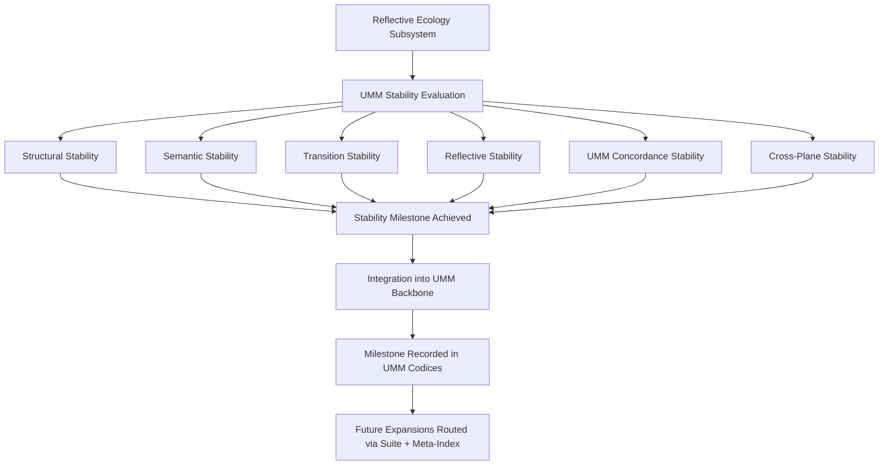

# **📘 UMM STABILITY MILESTONE DIAGRAM**  
### *Subsystem Closure • Structural Maturity • Reflective Stability Backbone*

This diagram expresses the **full stability milestone logic**:

- subsystem enters evaluation  
- each stability dimension is checked  
- all dimensions converge into the milestone verdict  
- milestone integrates into the UMM backbone  
- future expansions are routed through Suite + Meta‑Index  

It is the **structural signature** of subsystem maturity.

---

