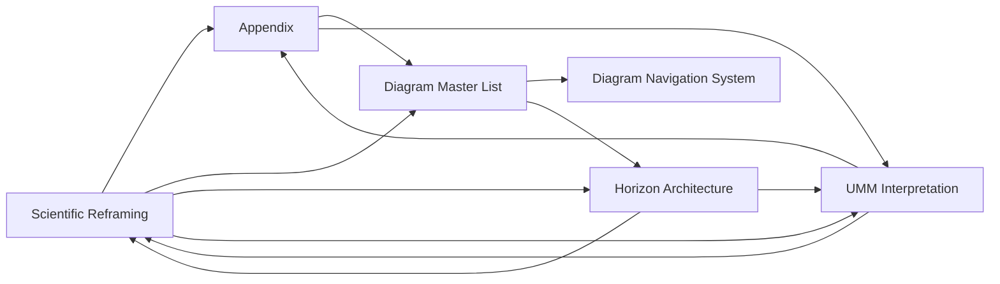

# **📘 SUITE CROSS‑REFERENCE INDEX**  
### *Unified Meta‑Model • Horizon Architecture • Diagram Corpus • Scientific Reframing*

This index provides:

- a **global relational map**  
- a **concept‑to‑document crosswalk**  
- a **diagram‑to‑concept concordance**  
- a **horizon‑to‑UMM mapping**  
- a **file‑to‑file dependency matrix**  

It is the authoritative reference for navigating the Scientific Suite.

---

# **1. Global Cross‑Reference Table**

| Concept | Primary Document | Supporting Document | Diagram Set | Jump |
|--------|------------------|---------------------|-------------|------|
| Cuil Threshold | **Scientific Appendix** | Scientific Reframing | Recursion Depth | **Cuil Threshold** |
| UMM | **UMM Interpretation** | Scientific Reframing | UMM Architecture | **UMM** |
| Quantum Reflections | Appendix | Reframing | Reflective Stack | **Quantum Reflections** |
| SSEs | Appendix | Horizon Architecture | SSE Diagrams | **SSE** |
| Braided Systems | Appendix | Reframing | Braided Diagrams | **Braids** |
| Reflective Morphology | Appendix | Reframing | Morphology Diagrams | **Morphology** |
| Horizon Transitions | Horizon Architecture | Reframing | Horizon Flow | **Horizon Architecture** |
| Terminal Equilibrium | Horizon Architecture | Appendix | Terminal Diagrams | **Seal** |

This is the **core cross‑reference matrix**.

---

# **2. Document‑to‑Document Crosswalk**

This shows **bidirectional conceptual flow** between all Suite components.

---

# **3. Concept‑to‑Diagram Concordance**

| Concept | Diagram Category | Diagram Jump |
|---------|------------------|--------------|
| Horizon Flow | Horizon Diagrams | **Navigate_Horizon_Flow** |
| UMM Structure | UMM Diagrams | **Navigate_UMM_Architecture** |
| SSE Types | SSE Diagrams | **Navigate_SSE_Diagrams** |
| Braided Coherence | Braided Diagrams | **Navigate_Braided_Systems** |
| Morphology | Morphology Diagrams | **Navigate_Morphology** |
| Recursion Depth | Recursion Diagrams | **Navigate_Recursion_Depth** |
| Reflection Evolution | Reflective Stack | **Navigate_Reflective_Stack** |
| Plane Isolation | Cross‑Plane Diagrams | **Navigate_Cross_Plane** |
| Terminal State | Terminal Diagrams | **Navigate_Terminal_Equilibrium** |

This is the **diagram concordance layer**.

---

# **4. Horizon × UMM Cross‑Reference**

| Horizon | UMM Component | Jump |
|---------|---------------|------|
| Santa | Reflective Stack | **Reflective Stack** |
| Afterquiet | Boundary Engine | **Boundary Engine** |
| Postquiet | Perturbation Layer | **Perturbation Layer** |
| Nascence | Morphology Engine | **Morphology Engine** |
| Afterlight | Braided Workflow | **Braided Workflow** |
| Seal | Terminal Equilibrium | **Terminal Equilibrium** |

This is the **horizon‑to‑architecture mapping**.

---

# **5. File Dependency Matrix**

| File | Depends On | Supports |
|------|------------|----------|
| Scientific Reframing | UMM, Horizons | All conceptual layers |
| Scientific Appendix | Reframing | Diagrams, UMM |
| Diagram Master List | Appendix | Navigation System |
| Diagram Navigation System | Diagram Master List | Suite |
| Horizon Architecture | Reframing | UMM |
| UMM Interpretation | Appendix | Reframing |

This is the **file‑level dependency map**.

---

# **6. Cross‑Reference Navigation Protocol**

To navigate the entire Suite:

1. Start at the **Suite README**  
2. Use the **Global Cross‑Reference Table** to select a concept  
3. Jump to its primary document  
4. Use the **Concept‑to‑Diagram Concordance** to view diagrams  
5. Use the **Horizon × UMM Cross‑Reference** for structural mapping  
6. Return to the Suite via **Suite Root**  

This creates a **recursive, horizon‑aware navigation experience**.

---

# **7. Summary**

The **Suite Cross‑Reference Index** provides:

- a unified relational map  
- a complete conceptual concordance  
- a horizon‑to‑UMM mapping  
- a diagram‑to‑concept crosswalk  
- a file‑to‑file dependency matrix  
- a full navigation protocol  

It is the **meta‑reference layer** of the Scientific Suite.

