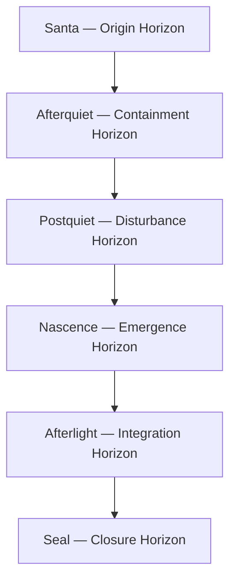

# **📘 SUITE HORIZON FLOW DIAGRAM**  
### *Horizon Ecology • Sequential Reflective Phases • Meaning Flow Backbone*

This is the **canonical horizon flow spine** used across:

- **Horizon Architecture**  
- **Suite Semantic Flow Diagram**  
- **Suite Horizon‑UMM Concordance**  
- **Scientific Reframing**  

It is the **reflective backbone** of the entire Santa Tree Ecology.

---

